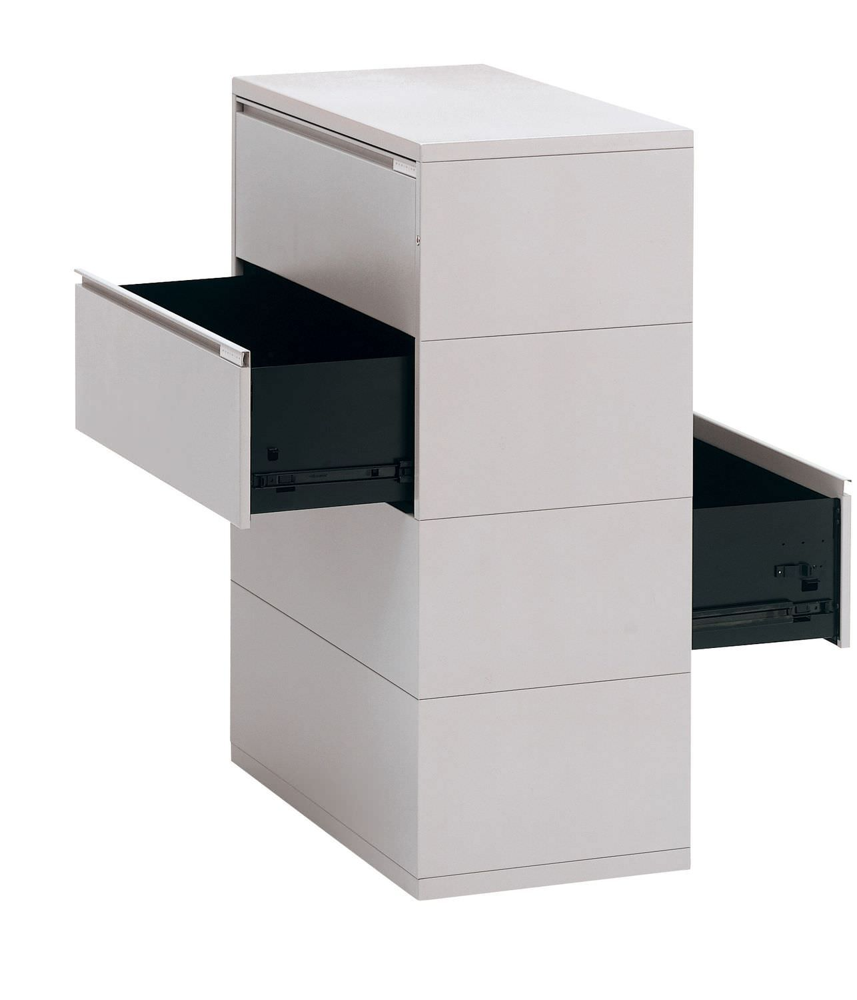
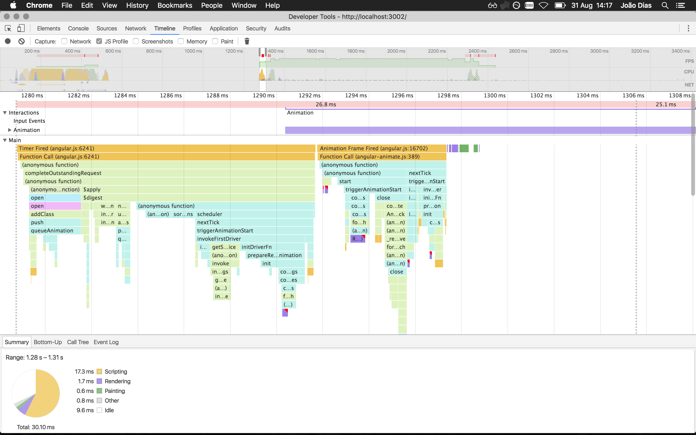
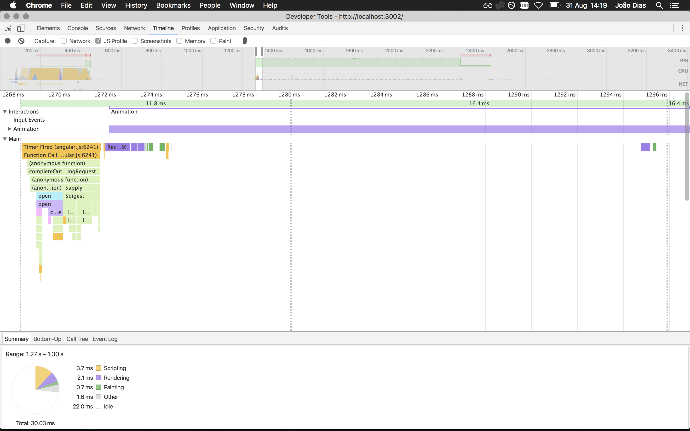

# Angular 1: A `$digest` cycle tale

One of the components of our _Angular Front-end Framework_ is what we call [Angular Slider Drawer](https://github.com/cherrytech/angular-slider-drawer) which is basically a set of directives to make a robust panel sliding system.

Some of our applications are built on top of this component because it defines and handles the disposition of the various panels (drawers) in various states. Due to this, I wasn't too happy that we were forcing an extra `$digest` cycle  and DOM render by using `$timeout` in a few places.

I had some free time, and decided to have a proper look at it, what it does and how it does it, and started profiling away. In the end I basically ended refactoring most of the component pieces to make better use of recent Angular 1 functionality, but the most important piece of the puzzle is the use of the scope `$evalAsync` method instead of `$timeout` to include the disposition calculation in the current `$digest` cycle whenever possible.

## What does `$evalAsync` do?

Executes the expression on the current scope at a later point in time.

The [`$evalAsync`](https://docs.angularjs.org/api/ng/type/$rootScope.Scope#$evalAsync) makes no guarantees as to when the `expression` will be executed, only that:

- it will execute after the function that scheduled the evaluation (preferably before DOM rendering).
- at least one [`$digest`](https://docs.angularjs.org/api/ng/type/$rootScope.Scope#$digest) cycle will be performed after `expression` execution.

## Final result

So the result of this refactoring is that I was able to get rid of the extra digest cycle, meaning less work for the browser, and the animations starting earlier.

Here goes a comparison of the first 30ms before and after the refactoring:

__Before__

__After__

__Notes__
* Both profiling sessions were started the same way: a 1s timeout opening 2 chained drawers, after 2 refreshes.
* After the optimization, the sliding animation starts at least 25% faster.
* Because we don't need an extra `$digest` cycle anymore, the browser does much less work. (even until the animation ends as you can see on the greyed out timeline graph after the first 30ms)
* There are no long frames after the optimization. (Chrome marks long frames in red at the top, and the less of those, the more fluid the application is. Ideally, all frames should be green.)
* Related PR with the changes: https://github.com/cherrytech/angular-slider-drawer/pull/2
